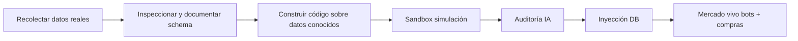

# Visión del proyecto

## Objetivo

Llenar de vida el mercado de un servidor privado de Ragnarok Online (rAthena) mediante bots económicos que:

1. **Venden** ítems recolectados (simulados o inyectados) en tiendas autotrade creíbles.
2. **Compran** a jugadores reales cuando el precio es razonable respecto a un diccionario de referencia.
3. **No rompen** la economía: sin inflación infinita de Zeny, sin sobreprecios absurdos, sin floods de ítems raros.

El servidor no debe sentirse vacío. Los mercaderes deben parecer jugadores auténticos con carro, nombres creíbles y carteras en mapas como Prontera.

## Audiencia

Jugadores reales del servidor familiar. El sistema existe para mejorar su experiencia, no para farmear en su nombre ni para obtener ventaja injusta.

## Pipeline (etapas lógicas)

La secuencia **obligatoria** es: datos → inspección → código. No al revés.

## Etapas de implementación (borrador)

| Etapa | Qué hace | Estado |
|-------|----------|--------|
| **M0** | Documentos de diseño, repo mínimo | En curso |
| **M1** | Recolectar y versionar datos (YAML, conf, mercado, dump DB) | Pendiente |
| **M2** | Simulación sandbox en memoria (dry-run) | Pendiente |
| **M3** | Logs estructurados + auditoría con IA | Pendiente |
| **M4** | Escritura a DB (primero clon SQLite local) | Pendiente |
| **M5** | Producción MySQL + watcher de mercado activo | Pendiente |

Cada etapa tendrá su propio plan iterado. No implementar etapas futuras hasta completar la anterior.

## Qué SÍ es este proyecto

- Simulación estadística de farmeo (loot por horas, sin mover personajes en tiempo real).
- Diccionario de precios ajustado al rate del servidor.
- Inyección controlada de loot y tiendas en la DB de rAthena.
- Compras automáticas a jugadores reales dentro de límites de precio.
- Auditoría de salud económica con logs + IA.

## Qué NO es este proyecto

- **No** es un bot de farmeo en vivo (no conecta al cliente ni al map server).
- **No** es cheat, hack ni bypass de anti-bot.
- **No** es un framework genérico de RO — es una herramienta personal para un servidor concreto.
- **No** reemplaza el juicio humano en decisiones de balance; la IA audita, no manda.

## Fase SQLite: clon del servidor real

Para desarrollo seguro, se clonará el MySQL de producción tal cual está y se convertirá a SQLite local. Los bots y sus interacciones se diseñarán observando **datos reales** de jugadores existentes (patrones de vending, zeny, inventarios), no perfiles inventados.

Ver [03-server-snapshot.md](03-server-snapshot.md) para el procedimiento.

## Criterio de éxito

Un jugador real entra a Prontera, ve varias tiendas activas con precios razonables, puede venderle cosas a un bot sin sentir que le regalan Zeny, y la economía del servidor se mantiene estable semana tras semana.
