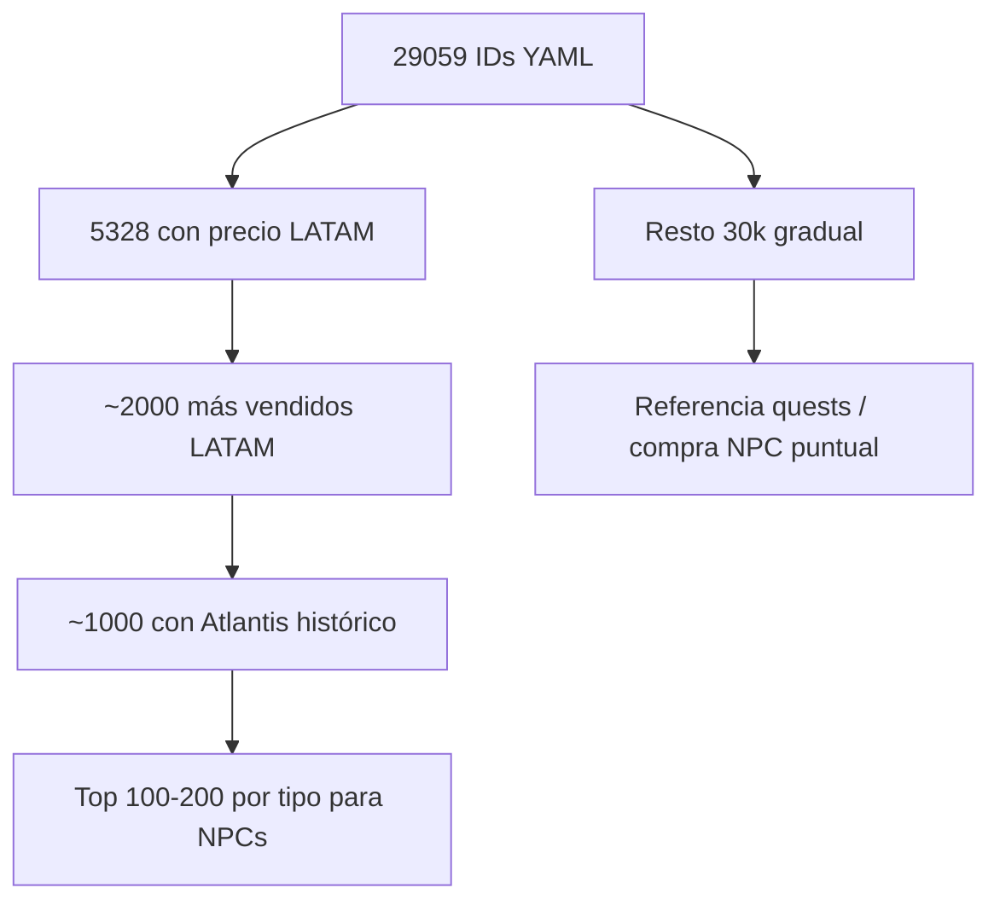

# Plan de curación de mercado (por capas)

Estrategia para no depender de los 29k ítems del YAML completo, sino ir refinando hacia un núcleo útil para bots, NPCs y quests.

## Principio

> Descargar todo una vez da referencia; **operar** solo sobre subconjuntos curados.

Los 29k se completan de a poco en días (atlantis, ragnapi) como biblioteca de consulta. El trabajo diario usa listas cada vez más pequeñas y accionables.

## Capas de refinamiento



| Capa | Cantidad | Criterio | Uso principal |
|------|----------|----------|---------------|
| **0** | 29,059 | Todo el `item_db` Renewal | Inventario completo |
| **1** | 5,328 | LATAM FREYA con `offers` o `market` | Punto de partida mercado |
| **2** | ~2,000 | Top por `totalSold` LATAM | Atlantis batch acotado |
| **3** | ~1,000 | Top por `total_sold` Atlantis + validación | Diccionario de precios bots |
| **4** | 100–200 | Por `type` (consumible, equip, etc.) | NPCs shops focalizados |

### Archivos generados (capa 1–2)

En `staging/market/latam_tools/curated/` (commitear en git):

| Archivo | Contenido |
|---------|-----------|
| `in_market_ids.txt` | 5,328 IDs con datos de precio |
| `with_offers_ids.txt` | 4,065 IDs con vending activo |
| `top2000_ids.txt` | Top 2,000 por `totalSold` LATAM |
| `ranked_market.json` | Ranking completo con median, totalSold, type |
| `summary.json` | Estadísticas y metadatos |

Bulk crudo (115 MB) en `bulk/FREYA/items/` — **local, gitignored**.

## Fuentes y rol de cada una

| Fuente | Estado | Rol en el plan |
|--------|--------|----------------|
| **LATAM FREYA** | completo (29k) | Filtrar capas 1–2; vending actual |
| **Atlantis** | pendiente | Capa 3: `total_sold`, std_dev, NPC buy/sell histórico |
| **RagnaAPI** | pendiente | Drops/metadata para quests (no precios) |
| **Divine Pride** | pendiente key | Ancla NPC oficial si hace falta |
| **YAML OzRo** | local | Custom 35001–35005, buy/sell NPC propio |
| **Vendings OzRo** | bloqueado | Validar precios reales cuando haya autotrade |

## Próximos pasos (cuando retomemos)

### Corto plazo
1. **Atlantis** solo sobre `top2000_ids.txt` (~2–3 h con delays)
2. Cruzar LATAM + Atlantis → generar `top1000_ids.txt`
3. Agrupar por `type` → `npc_focus_top200.json` (top N por categoría)

### Medio plazo
4. Promover capa 3 validada a `data/market/price_dictionary.json`
5. Atlantis/ragnapi sobre el resto de 29k **de a poco** (referencia, no bloqueante)
6. Vendings OzRo cuando exista autotrade

### Usos finales

| Uso | Dataset |
|-----|---------|
| Bots compran/venden | Capa 3 (~1k) + YAML NPC |
| NPC shops Prontera/Geffen | Capa 4 (100–200 por tipo) |
| Quest rewards | RagnaAPI drops + precio capa 1–3 |
| Compra NPC a jugadores | Capa 3 + vendings OzRo |
| Ítems custom OzRo | YAML local, diseño manual |

## Comandos de referencia

```bash
# Ya hecho
python staging/market/fetch_batch.py latam --server FREYA --resume

# Siguiente sesión — Atlantis acotado
python staging/market/fetch_batch.py atlantis \
  --items-file staging/market/latam_tools/curated/top2000_ids.txt --resume

# Completar 30k gradual (noches sueltas)
python staging/market/fetch_batch.py atlantis --resume
python staging/market/fetch_batch.py ragnapi --resume
```

## Limitaciones conocidas

- LATAM es bRO oficial; OzRo tiene rates custom (5x–100x) — precios son **referencia relativa**, no absoluta
- ~15k IDs del YAML no existen en mercado LATAM (normal en Renewal)
- Casos excepcionales (ítems raros, eventos) pueden quedar fuera del top — revisar manualmente al diseñar quests específicas
